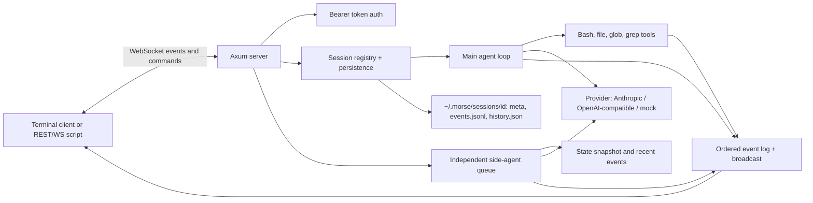

# Architecture

For developers extending the runtime or writing another client.



## Crates

| Crate | Responsibility |
|---|---|
| `morse-core` | Protocol, session workers, task state, tool execution, providers, persistence, side agent |
| `morse-server` | Session registry, token auth, REST endpoints, WebSocket transport, restore-on-boot |
| `morse-cli` | CLI commands, reconnecting client, TUI/plain/headless renderers |

## Providers

`Provider` is one trait: `complete` plus `complete_stream`, which streams text fragments to a callback. The default `complete_stream` buffers and emits once, so a provider only implements what it supports.

- `provider_anthropic.rs` — Anthropic Messages API, SSE streaming (`text_delta`, `input_json_delta`), usage from `message_start`/`message_delta`.
- `provider_openai.rs` — OpenAI `/chat/completions` and any compatible endpoint (Ollama, OpenRouter, DeepSeek, …), SSE streaming with `stream_options.include_usage`, tool-call fragments accumulated by index.
- `provider_mock.rs` — deterministic demo parser (`run`, `create file`, …) with the same plan/tool semantics.

`llm::retry_request` retries network errors and 408/409/425/429/5xx up to three times with backoff. `sse::for_each_data` splits `data:` frames across chunk boundaries. Provider selection happens in `llm::provider_from_env`.

## Work and observation

Each session owns an instruction queue and a separate side-question queue. Main instructions execute serially; side questions can be answered while a shell command runs. Runner tasks hold a `Weak<Session>`, so an idle session can be dropped for eviction or shutdown.

Every session event gets a monotonic sequence number. A single emission lock orders state update, log append, file append, and broadcast. Attaching subscribes and snapshots under that same lock. The server sends `hello`, then replay, then live events. Clients suppress already-seen sequence numbers on automatic reconnect. Sequence zero denotes connection-level messages.

The in-memory log retains 4,000 events and the broadcast buffer holds 2,048. A lagging connection closes and reconnects. Event-file rotation also occurs at 8 MiB (keeping the newest 4,000 events).

## Persistence

Each session directory holds:

```text
~/.morse/sessions/<id>/
  meta.json      # id, workspace, created_ts
  events.jsonl   # append-only envelopes, rotated at 8 MiB
  history.json   # model conversation for the main agent
  ws/            # default workspace
```

`Session::enable_persistence` appends events synchronously on emit and writes `history.json` at run end. `App::load_sessions` restores every directory under `sessions/` at boot: replaying events rebuilds `SessionState` and the in-memory log, and `history.json` restores model context so the next instruction continues where the last one stopped. `MORSE_MAX_SESSIONS` (default 64) evicts the oldest idle session from memory only; files remain and reload at the next boot.

## HTTP and WebSocket API

Connect to `/ws`; the first message must arrive within 15 seconds:

```json
{"type":"create","workspace":null}
```

Or attach with `{"type":"attach","session_id":"<id>"}`. Subsequent commands:

```json
{"type":"instruction","text":"run echo hello"}
{"type":"side_query","text":"what is running?"}
{"type":"interrupt"}
{"type":"ping"}
```

Events: `hello`, `instruction`, `status`, `plan`, `agent_delta` (streaming prose fragment), `agent_text` (notices such as "interrupted"), `tool_call`, `output`, `tool_result`, `file_edit`, `side`, `usage`, `error`, `pong`. Each contains `seq`, `ts` (Unix milliseconds), and `type`; output and file edits carry their originating tool call ID. See [protocol.rs](../crates/morse-core/src/protocol.rs).

REST (JSON): `GET /healthz`, `GET /api/sessions`, `POST /api/sessions`, `GET /api/sessions/{id}`, `POST /api/sessions/{id}/instruction`, `POST /api/sessions/{id}/interrupt`, `GET /api/sessions/{id}/events?since=&limit=`. Set `MORSE_TOKEN` to require `Authorization: Bearer <token>` (or `?token=`), which covers `/api/*` and `/ws`; `/healthz` stays open.

## Tools and cancellation

`bash` drains stdout and stderr concurrently with execution; output streams to clients within 8 KiB reads and the retained result is capped at 256 KiB. Bash defaults to a 120-second timeout. On Unix, commands run in their own process group killed when the tool is dropped, and a canceled tool also kills descendants. Interrupts cancel pending model requests. A model run is limited to `MORSE_MAX_TURNS` (default 48).

`read_file`, `write_file`, `edit_file`, `list_files`, `glob`, and `grep` resolve paths lexically inside the workspace and reject traversal. `glob` and `grep` walk files skipping hidden entries, `target/`, and `node_modules/`; grep skips files over 2 MiB and binary content.

Tool results go back to the provider including errors. The side agent has no tools and sees a state snapshot plus 40 summarized recent events. In demo mode it reports deterministic status; if its live provider fails it falls back to that status.

## Streaming model text

`AgentDelta` fragments are emitted as the provider produces them; clients append them to the current agent message. `AgentText` remains for runtime notices. `Usage` carries per-response token counts, which the session state accumulates and the client status bar shows.

## Boundaries and remaining limits

- The server owns host-level command execution. It is neither a VM manager nor a sandbox.
- File-tool checks reject lexical traversal, but symlinks and Bash can reach outside the workspace.
- Model API credentials are excluded from Bash's inherited environment. This does not isolate commands from other host secrets.
- Instructions and side queries use unbounded queues; there are no tenant quotas.
- `MORSE_TOKEN` is a shared secret; use TLS or an SSH tunnel for untrusted networks.
- Side answers describe a snapshot and can become stale while the main agent continues.
- WebSocket commands have no acknowledgement IDs or durable retry queue. Check session state before resending after an uncertain disconnect.
- No MCP client, no subagents, no git automation (see [Comparison](comparison.md)).
