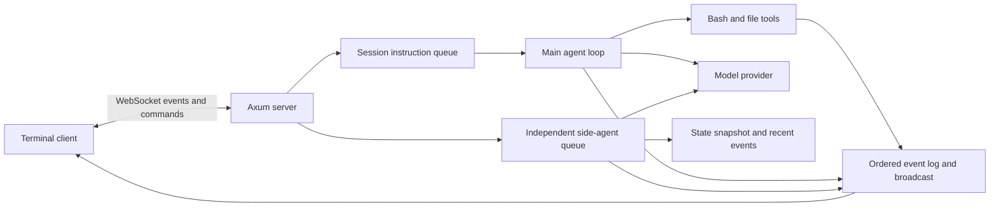

# Architecture

For developers extending the runtime or adding a client.



## Crates

| Crate | Responsibility |
|---|---|
| `morse-core` | Protocol, session workers, task state, tool execution, Anthropic/demo providers, side-agent answers |
| `morse-server` | Session registry, REST discovery, WebSocket transport |
| `morse-cli` | CLI commands, reconnecting client, plain output and ratatui panes |

## Work and observation

Each session owns an instruction queue and a separate side-question queue. Main instructions execute serially; side questions can be answered while a shell command runs. Closing a socket does not cancel either worker.

Every session event gets a monotonic sequence number. A single emission lock orders state updates, log append, and broadcast. Attaching subscribes and snapshots under that same lock. The server sends `hello`, then replay, then live events. Clients suppress already-seen sequence numbers on automatic reconnect. Sequence zero denotes connection-level messages.

The in-memory log retains 4,000 events and the broadcast buffer holds 2,048. A lagging connection closes and reconnects. If an absence exceeds the retained log, older events cannot be recovered. There is no durable replay or automatic session restoration after server restart.

## WebSocket messages

Connect to `/ws`. The first message must arrive within 15 seconds:

```json
{"type":"create","workspace":null}
```

Or attach with `{"type":"attach","session_id":"<id>"}`. Subsequent commands:

```json
{"type":"instruction","text":"run echo hello"}
{"type":"side_query","text":"what is running?"}
{"type":"interrupt"}
{"type":"ping"}
```

Events include `hello`, `instruction`, `status`, `plan`, `agent_text`, `tool_call`, `output`, `tool_result`, `file_edit`, `side`, `error`, and `pong`. Each contains `seq`, `ts` (Unix milliseconds), and `type`. See [protocol.rs](../crates/morse-core/src/protocol.rs) for fields. Output and file edits carry their originating tool call ID.

`GET /healthz` reports process health. `GET /api/sessions` lists session state. `POST /api/sessions` creates a session with an optional `workspace` string.

## Tools and cancellation

Bash stdout and stderr are drained concurrently with process execution; this allows early output and avoids pipe-buffer deadlock. The retained tool output is capped at 256 KiB. Bash defaults to a 120-second timeout. On Unix, commands run in their own process group, which is killed when the tool is dropped. Interrupts also cancel pending model requests. A model run is limited to 48 turns.

The main agent submits tool results back to the provider, including errors. The side agent has no tools and sees a state snapshot plus 40 recent summarized events. In demo mode it reports deterministic status; if its live provider fails it falls back to that status.

## Boundaries and remaining limits

- The server owns host-level command execution. It is neither a VM manager nor a sandbox.
- File-tool checks reject lexical traversal, but symlinks and Bash can reach outside the workspace.
- Model API credentials are excluded from Bash's inherited environment. This does not isolate commands from other host secrets.
- Instructions and side queries use unbounded queues; there are no tenant quotas or session eviction.
- Side answers describe a snapshot and can become stale while the main agent continues.
- Model responses use the non-streaming Messages endpoint. Tool activity streams independently.
- WebSocket commands have no acknowledgement IDs or durable retry queue. Check session state before resending after an uncertain disconnect.
