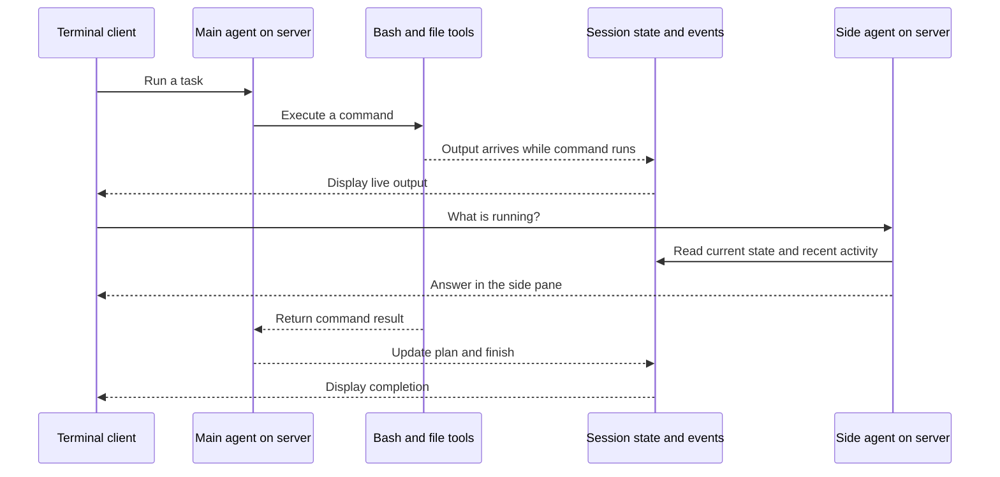

# How Morse works

A guide for trying Morse and deciding where it fits in your workflow. For install steps see [Setup](setup.md).

## The idea

Morse lets you send work to a computer and watch it happen from your terminal. That computer can be your laptop or a remote server.

A **harness** is the runtime around the agent: it accepts instructions, calls the model, executes tools, records results, and sends updates to you. Morse supplies that runtime, plus persistence (sessions survive restarts) and a second agent for questions.

You get two views:

- **Main stream:** model prose (streaming token-by-token), commands, output, file diffs, task plans, token usage, and completion messages.
- **Side agent:** answers about the work, without interrupting it or changing files.

## Follow one request



1. The client connects over **WebSocket**, a connection that carries commands to the server and events back to the client. A REST API exposes the same sessions for scripts.
2. The server creates a **session**: a workspace directory, instruction queue, model history, task state, and an event log that is written to disk.
3. The main worker handles one instruction at a time. The provider chooses tools, the runtime executes them, and their results go back to the provider. Model text streams as the provider produces it.
4. Tool output is sent as it arrives. File writes and edits produce diffs. Plan updates show pending, active, and completed tasks.
5. `/ask` uses a separate queue and worker. It can answer while the main worker is busy.

At the end of each run the model conversation is written to `history.json`, and every event is appended to `events.jsonl`. Restart the server and the session resumes with that context.

## What the side agent knows

It sees the current instruction, task list, agent prose so far, current tool, recent tool results, token totals, and recent activity. In live mode it receives 40 summarized recent events and a short side-conversation history.

It has **no tools**. Asking it to change a file does not give it the main agent's capabilities. Send work as a normal instruction instead — Morse can run several sessions at once for that.

Answers describe a snapshot taken when the question is handled. Work can advance before the answer reaches you. The side agent does not independently inspect every file or verify the main agent's claims.

## Two modes

| | Demo mode | Live mode |
|---|---|---|
| Setup | No model key | Anthropic or any OpenAI-compatible endpoint |
| Instructions | Supported command phrases | Natural-language requests |
| Tool selection | Deterministic parser | Model chooses tools |
| Side answers | Fixed status summary | Model answers from session context |
| Shell and file operations | Real | Real |
| Streaming | Tool output streams | Tool output and model text both stream |

Demo mode is also a test harness: all integration tests run against it, so the product's full loop is exercised without API keys.

## Try a complete example

### 1. Start the server

```sh
cargo build --release --locked
./target/release/morse serve
```

### 2. Open the client in another terminal

```sh
./target/release/morse connect
```

Copy the session ID shown in the status bar if you want to reconnect later.

### 3. Give it work

```text
run echo started && sleep 10 && echo finished then create file notes.txt: built with Morse
```

You should see `started` before the ten-second pause finishes. The file task is still pending at this point.

### 4. Ask during the pause

```text
/ask what's done and what's running?
```

The demo side answer reports `0/2 tasks done`, the active Bash command, and the pending file task.

### 5. Inspect the result

After the task finishes:

```text
read file notes.txt
```

The content appears in the tool result. The file lives on the **server** under `~/.morse/sessions/<id>/ws/notes.txt`.

### 6. Restart and come back

Stop the server with Ctrl+C, start it again, then:

```sh
./target/release/morse sessions
./target/release/morse connect --session <id>
```

The session is still there, with its task list, replay, and model context intact.

## Practical use cases

### Watch tests on another computer

Start Morse on a server with Rust and your project installed. Connect through an SSH tunnel, then choose that server's project path:

```sh
./target/release/morse connect --workspace /path/on/server/my-project
```

In the client:

```text
run cargo test
/ask what is running?
```

You can see output and ask for status during the run, disconnect, and reconnect later. Morse does not clone repositories or provision servers. A Bash call defaults to a 120-second timeout; long jobs need a larger `timeout_ms` or a separate job runner.

### Ask a model to make a focused change

With a live provider configured:

```text
Add a /healthz endpoint that returns ok. Run the existing tests and summarize the files changed.
/ask which step is in progress?
```

The model can plan, find files (`glob`, `grep`), read, write, edit, and run commands. Review the diff and test output; the plan is the agent's report of its progress.

### Drive it from CI

```sh
morse run --json "run cargo test" | jq -c 'select(.type=="tool_result")'
```

`morse run` exits non-zero if the run reports an error or times out, so it can gate a pipeline. The REST API does the same from any language.

### Run a small file workflow without a model

```text
create file checklist.txt: review build output then read file checklist.txt then list files
```

This is useful for learning the event flow or demonstrating the client with no API costs. Demo parsing splits on lowercase ` then ` and semicolons, so use `&&` to chain commands inside a single Bash step.

## Disconnect, return, or stop

- `/quit` disconnects the client. The main task keeps running while the server stays alive.
- `morse connect --session <id>` reconnects and replays up to the last 4,000 retained events.
- `/interrupt` cancels the current run and kills the command's process group; it does not undo file changes.
- Restarting the server now **keeps** sessions: state, history, and workspaces are reloaded from disk.

## Where it fits today

Morse is a terminal-based, single-user agent runtime. It does not provide a browser desktop, video stream, VM provisioning, or an OS sandbox. Commands run with the server user's permissions. There is no MCP tool ecosystem, no subagents, and no git automation.

Keep the server on loopback and access remote instances through SSH or the built-in token over TLS. Use it on a computer and workspace you control. See [Comparison](comparison.md) for how it stacks up against other agents, [Operations](operations.md) for running it, and [Architecture](architecture.md) for the protocol and implementation.
